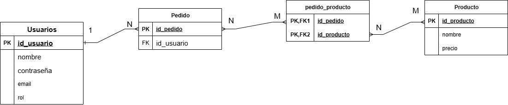
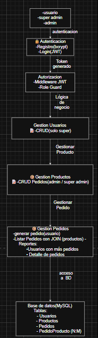

# 📝 Examen Parcial – Backend con Node.js, Express y Docker

Este repositorio contiene la resolución del examen parcial para la materia **Backend**.  
El proyecto implementa un sistema de **Usuarios, Pedidos y Productos** con **autenticación JWT**, **roles** y **contenedores Docker**.


---

## 📦 Tecnologías utilizadas

- **Node.js**  
- **Express.js**  
- **MySQL**  
- **Docker** y **Docker Compose**  
- **JWT (JSON Web Token)**  usuario
- **Bcrypt** para cifrado de contraseñas  
- **dotenv** para configuración con `.env`

---

## 🚀 Cómo ejecutar el proyecto

### Requisitos previos

- Tener instalado **Docker** y **Docker Compose**  
- Tener **Git** para clonar el repositorio

### Pasos para levantar el proyecto

1. **Clonar el repositorio**
   ```bash
   git clone https://github.com/LautaroGomez97/gomezmaciaslautaro-backend-examen.git
   cd gomezmaciaslautaro-backend-examen
   ```

2. **🔑 Crear variables de entorno (.env)**  
    ### Archivo .env

    ```env
    PORT=3000
    DB_HOST=localhost
    DB_PORT=3309
    DB_USER=root
    DB_PASSWORD=tu_clave
    DB_NAME=UTNExamen
    JWT_SECRET=clave_secreta

3. **Levantar docker**
   ```bash
   docker-compose up --build

   ```

4. **Acceder a la aplicación**
   - API: `http://localhost:3000`  
   - MySQL (host): `localhost:3309` (usuario `root`, password `userpass`)

---
### 🔑 SuperAdmin por defecto

- Al iniciar la base de datos por primera vez, **se crea automáticamente un usuario SuperAdmin**.  
- **Email:** `superadmin@utn.com`  
- **Contraseña:** `super1234`  
- Podés iniciar sesión con estos datos directamente usando Postman o cualquier cliente HTTP.  
---

## 📐 Modelo de Datos (DER)

El siguiente diagrama muestra el **modelo entidad–relación** diseñado para el sistema:



### **Breve explicación**
- Un **Usuario** puede realizar muchos **Pedidos** (relación **1:N**).  
- Un **Pedido** puede contener muchos **Productos**, y un **Producto** puede pertenecer a muchos **Pedidos** — por eso existe la tabla intermedia **`pedido_producto`** (relación **N:M**).  
- Tablas principales: **`Usuarios`**, **`Pedido`**, **`pedido_producto`**, **`Producto`**.

### Tablas principales (resumen)

- **`Usuarios`**
  - `id_usuario` (PK)  
  - `nombre`  
  - `contraseña` (hasheada con **bcrypt**)  
  - `email` (UNIQUE)  
  - `rol` (ENUM: **superAdmin**, **admin**, **usuario**)

- **`Pedido`**
  - `id_pedido` (PK)  
  - `id_usuario` (FK → `Usuarios.id_usuario`)  
  - `fecha` (TIMESTAMP)

- **`pedido_producto`**
  - `id_pedido` (PK, FK)  
  - `id_producto` (PK, FK)  
  - `cantidad` (INT)

- **`Producto`**
  - `id_producto` (PK)  
  - `nombre`  
  - `precio` (DECIMAL)

--- 

## 🗂 Diagrama funcional (DFD / flujo funcional)



### **Breve explicación**
- El diagrama informativo muestra el **flujo funcional**: registro/login → interacción con la API → operaciones sobre la base de datos.  
- Visualiza qué roles (**`superAdmin`**, **`admin`**, **`usuario`**) participan en cada proceso y qué componentes interactúan (cliente → API → BD).

---

## 🧭 Estructura del proyecto (visión rápida)

```
├── src/
│   ├── config/        # Configuración (DB, JWT, etc.)
│   ├── controllers/   # Lógica de negocio
│   ├── middleware/    # Auth, validaciones, roles
│   ├── models/        # Consultas / modelos a la DB
│   ├── router/        # Rutas (usuarios, productos, pedidos, auth)
│   └── app.js         # Punto de entrada
├── assets/
│   ├── DER.png      # DER
│   └── DFD.svg # Diagrama funcional
├── .env
├── docker-compose.yml
├── package.json
└── README.md
```


---

## 🔑 Roles y permisos

| Rol        | Permisos principales                          |
|------------|-----------------------------------------------|
| superAdmin | Crear/eliminar usuarios, gestionar productos |
| admin      | CRUD de productos                             |
| usuario    | Generar pedidos propios                       |

---
## 📡 Endpoints principales

### Usuarios
- `POST /usuarios/registro` → Registrar un nuevo usuario
- `POST /usuarios/login` → Login y obtención de JWT
- `GET /usuarios/perfil` → obtener perfil del usuario logueado
- `GET //usuarios/listarUsuarios` → Listar todos los usuarios (solo superAdmin)
- `GET /usuarios/listarUsuariosPedidos ` → listarUsuariosConPedidos (solo superAdmin)
- `DELETE /usuarios/:id` → Eliminar usuario (solo superAdmin)


### Productos
- `GET /productos` → Listar productos
- `POST /productos` → Crear producto (admin/superAdmin)
- `PUT /productos/:id` → Modificar producto (admin/superAdmin)
- `DELETE /productos/:id` → Eliminar producto (admin/superAdmin)

### Pedidos
- `GET /pedidos` → Listar pedidos del usuario
- `POST /pedidos` → Crear pedido
- `GET /pedidos/usuarios` → Listar usuarios con sus pedidos (solo superAdmin)
- `GET /pedidos/detalles` → Listar pedidos con detalles de productos (solo superAdmin)
---


---
✍️ **Lautaro Gomez Macias**  
📚 Examen Parcial Backend – UTN  
🛡️ Proyecto validado con JWT, roles y contenedores Docker
